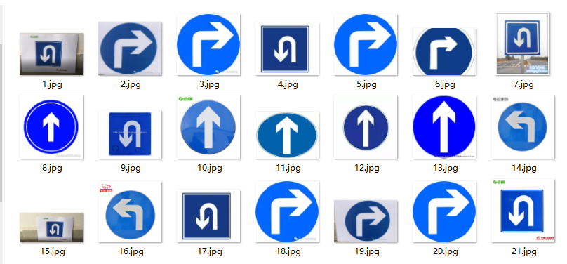
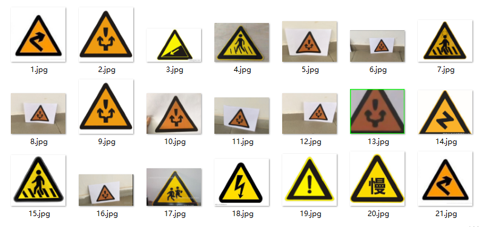
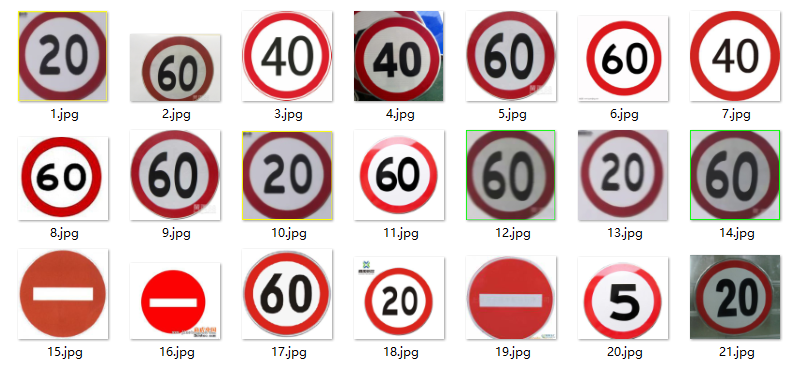
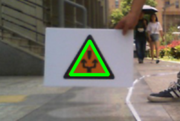
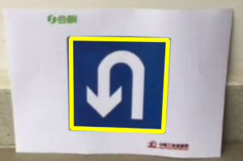
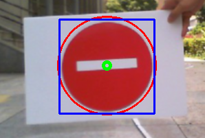

### Traffic Sign Detection
#### usage:
To use this detector, you can execute the following instructions:
```
git clone git@github.com:zhaott618/traffic_sign_detection.git
cd traffic_sign_detection
g++ circlejudge1.cpp judge.cpp -o judge
./judge
```
#### Implemented with:

- OpenCV2.3
- C++ using VS2013 IDE

#### Method description:
The detector mainly includes two stages: the stage of traffic sign detection and the stage of traffic sign recognition.

1.  The stage of traffic sign detection uses a combination of color segmentation and shape segmentation. After the classic steps involving color space converting, edge detection(using morphological and Canny), the algorithm of the minimum bounding circle and the polygonal approximation are used for shape segmentation. Finally, the target traffic sign are segmented from the background.
2.  In the stage of traffic sign recognition, which uses two-level SVM classifier. The first-level classification uses the extracted  color moments for rough traffic sign classification and traffic signs are classified into four categories. The second level uses the HOG feature to make a final subcategory of traffic signs. In addition, this paper also compares the recognition algorithm based on artificial neural network and SVM.

#### Dataset
The dataset is collected from the Google Images, and can be divided into three colors and three kinds of shapes(circle, triangle and rectangle). In case of meaning, which includes indication, prohbition, speed limitation and warning. Based on the color, the dataset can be depicted as:





#### Evaluation:
The detector is tested on the dataset collected by myself, and the AP on the dataset exceeds 90%. In addition, maintaining the pleased accuracy, this detector also ensure the efficiency which is >10fps on my laptop.





